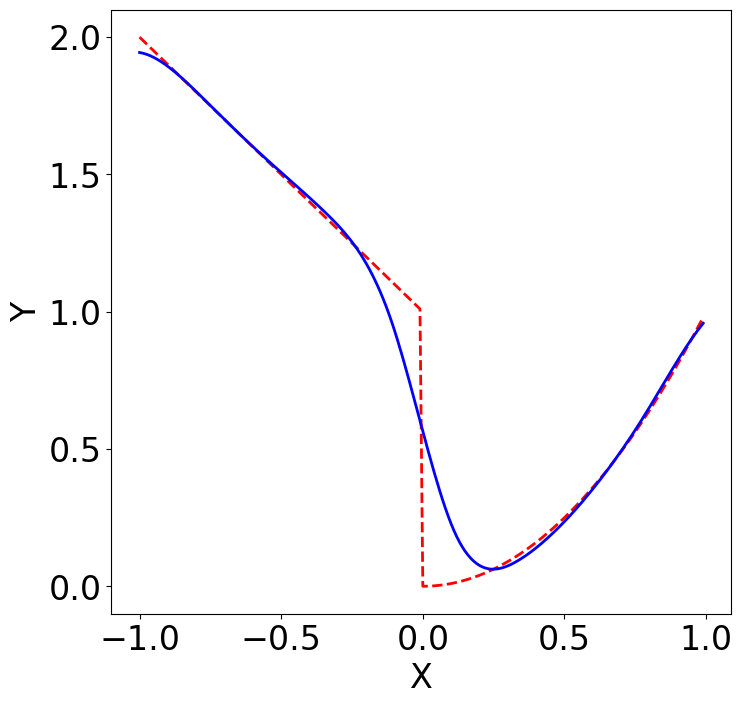

# cGP: clustered Gaussian process for non-smooth surrogate modeling

## **Content**

This is the code repository for the research publication "Non-smooth Bayesian Optimization in Tuning Problems" by [Hengrui Luo](https://hrluo.github.io/), [James W. Demmel](http://people.eecs.berkeley.edu/~demmel/), [Younghyun Cho](https://github.com/younghyunc), [Xiaoye S. Li](https://crd.lbl.gov/departments/applied-mathematics/scalable-solvers/members/staff-members/xiaoye-li/) and [Yang Liu](https://crd.lbl.gov/departments/applied-mathematics/scalable-solvers/members/staff-members/yang-liu/). 
The manuscript of this paper can be accessed at https://arxiv.org/abs/2109.07563

Below we describe the files in the folder for your reference.

### What is clustered GP (cGP)?
- **clustered GP (surrogate) model**  
    - clustered GP (cGP) is a Gaussian process(GP)-based (surrogate)  model that attempts to address potential non-smoothness in black-box functions.

    - cGP is a special case of partition-based GP surrogate model. Its (irregular) partition scheme is based on chosen clustering and classification methods.

    - cGP is a special case of additive GP model, and it enjoys nice theoretic properties within each additive component.

- **Motivation.** Simple GP surrogate model cannot model complex non-smoothness without much expertise. For example, multiple jumps/drops in black-box functions. This creates problems if optimum of the black-box function is near non-smoothness points. Below we show an example of the function $f(x)=-x+1$ if $x<0$; $f(x)=x^2$ if $x\geq 0$.
The blue line shows the GP surrogate fit based on an evenly spaced sample, it misses the minima $x=0$.

- **Advantages.** There are several advantages that cGP has over GP as surrogate models:
    - ***Discontinuity.*** If the true function has significant dis-continuities and relatively strong signal (matmul with averaging), then cGP can identify different regimes rather faithfully. 

    - ***Almost discontinuity.*** If the true function has optima hidden in a "silt-like" (low-dimensional and also nearly dis-continuous) region and strong signal, then cGP produces better and faster results, along with a nice partition scheme (e.g. Bukin N6 function $f(x,y)=100\sqrt{|y-0.01x^2|}+0.01|x+10|$). 

    - ***Rough and Noisy.*** If the true function has a noisy and rough surface, then cGP can be configured to perform as good as GP, usually faster, and come up with faithful clustering regimes (e.g. Schaffer N2 function $f(x, y)=0.5 + \{\sin^2(x^2-y^2)-0.5\}/\{(1+0.001(x^2+y^2))^2\}$).

    - ***Narrow optima.*** If the true function has optima in a relatively small region compared to the whole domain, then cGP may not produce very informative regimes (Easom function $f(x,y)=−\cos(x)\cos(y)\exp(−(x − \pi)^2−(y − \pi)^2)$) but it would reach better optima; and runs faster by multi-processing with several small GPs simultaneously. 

- **Implementation.** The cGP is implemented within the python framework in a flexible way:

    - cGP can be used alone as a surrogate model and it is built on python, compatible with scikit-learn/scipy format.
Computation
    - cGP also has natural computational advantage when handling large dataset. Instead of fitting one large GP, cGP fits multiple smaller GPs automatically and captures local behaviors in different components.
## **Usage**
### What parameters of cGP can I set?

There are two classes of parameters, we take a question-answer approach below to guide you through all these parameter setups. We can use `python cGP.py --help` or `python cGP.py -h` to view all available options and default values.

#### **Model specific parameters**

These parameters control the behavior of the surrogate model and numerical stability, usually not data-dependent. 

The very first question we should ask is that: do we believe there are different regimes in the black-box function (either theoretically or empirically)? 
Under the limited budget, more pilot samples usually lead to a better fitted surrogate model. Fewer samples are needed if the signal-to-noise ratio of the black-box function is high; fewer samples are needed if the black-box function has few non-smooth points. Although with sufficient samples cGP and GP shows little difference (since the clustering scheme would essentially be smoothed out by sufficient samples), when the samples are limited each component of cGP would require more parameters to be fitted. In addition, cGP provides a informative partition of the domain.

- **N_PILOT** The number of pilot samples need to draw from the black-box function $f$. We can set this using `-p <N_PILOT>` option. 

- **N_SEQUENTIAL** The number of sequential samples need to draw from the black-box function $f$. We can set this using `-s <N_SEQUENTIAL>` option.

- **N_COMPONENTS** This is the *maximal* possible number of clusters (provided by Bayesian-Dirichlet mixture) in the cGP surrogate model. This option will be used only if NO_CLUSTER=0(False). We can set this using `-c <N_COMPONENTS>` option; or we can set this using `'-C' <CLUSTER>` option that links an external python script that defines a customized cluster algorithm.

- **N_NEIGHBORS** In the current implementation, we use k-NN (k-nearest neighbors) to assign/classify new locations to fitted clusters. Therefore, if the black-box function is expected to be smooth within each regime, then a larger N_NEIGHBORS would produce a better result. We can set this using `-n <N_NEIGHBORS>` option; or we can set this using `'-N' <CLASSIFY>` option that links an external python script that defines a customized classify algorithm.

How often should the sequential sampling procedure use a random sampling scheme? Sometimes the random sampling, instead of surrogate model guided sampling (i.e. via acquisition function maximization), would accelerate the exploration of the domain. This allows faster exploration over the input domain, especially for wiggly black-box function $f$.

- **EXPLORATION_RATE** Exploration rate is the probability (between 0 and 1) that the next step produced by maximizing acquisition function. We can set this using `-e <EXPLORATION_RATE>` option.

    - If EXPLORATION_RATE = 1, then all the sequential samples would be chosen by maximizing the acquisition function over the domain. 

    - If EXPLORATION_RATE = 0, then all the sequential samples would be chosen by random uniform sampling over the domain. Like the explore-exploit trade-off, if the black-box function is believed to be very oscillatory, a lower EXPLORATION_RATE would allow the sequential sampling exploring the domain faster.

- **NO_CLUSTER** If NO_CLUSTER = 1(True), a simple GP will be used as a surrogate model. When you suspect whether there is non-smoothness in the black-box function, you can try with simple GP as surrogate model first. We can set this using `-g <NO_CLUSTER>` option. 

#### **Application specific parameters**

These parameters shall be chosen depending on the specific data source or application, and would be data-dependent.

- **F_TRUTH_PY** This specifies the name of the python script that defines black-box function $f$, it can be a path like `home/abc`, specifying the script `abc.py` under `home/`. By default, the script reads the `f_truth.py` within the same folder of the file `cGP.py`. You can modify the `f_truth` function in the `f_truth.py` file in the same folder. This defines the expensive black-box function you want to optimize over using cGP as a surrogate. We separate this as another file for the flexibility in practice, the best way is to use our example `f_truth.py` as a template for your applications. The f_truth.py should be written in following format:

    - f_truth: This function defines how you obtain the response from the black-box function.

    - boundary_penalty: This function expresses the apriori belief of the sampling over the given domain, this penalty would be added to acquisition function during sequential sampling. For example, if we do not want any samples near the boundary, so we decrease the acquisition function near the boundary of the domain, therefore acquisition sequential sampling would not touch the boundary points (but random sequential sampling would still get a chance to choose these boundary points as sequential samples if EXPLORATION_RATE<1). This could also be used to knock out some parameters if you want to avoid certain regions of the domain. Letting this function to be zero function would just allow typical acquisition sequential sampling. It could also be fed the X_sample in order to use sequential information.

    - get_bounds: This function defines the required constraints: the bounds that defines the input domain over which our search is performed.

    - bounds_constraint: This is a `scikit-optimize.Bounds` object that are automatically generated from get_bounds function, it is highly recommended that you modify get_bounds instead of this variables.

    - linear_constraint: This is a `scipy.optimize.LinearConstraint` object that defines linear constraints between input variables. This is optional.

    - nonlinear_constraint: This is a `scipy.optimize.NonlinearConstraint` object that defines non-linear constraints between input variables. This is optional.

    - censor_function: This is a function that censors the response values y drawn from the black-box function $f$. This is optional.

- **RND_SEED** This specifies the random seed for the pilot sampling for reproducibility. We can set this using `-r <RND_SEED>` option. 

- **OUTPUT_NAME** This specifies the customized filename for output dataset and logs, no extension is needed. If not supplied, the script would generate one using a randomized stamp. We can set this using `-o <OUTPUT_NAME>` option. 

- **OBJ_NAME** This specifies the customized filename for output fitted cGP surrogate model object, no extension is needed. If not supplied, the script would not save any object. We can set this using `-d <OBJ_NAME>` option. This option must be used along with `-d` option.

- **ACQUISITION** This specifies the customized filename for acquisition used in the cGP surrogate model object, no extension is needed. If not supplied, the script would not save any object. We can set this using `-A <ACQUISITION>` option.  

#### **Execution option parameters**
***Note: These parameters are abbreviated with a capital letter.***
- **PILOT_FILE** This specifies an external filename (absolute path and extensions need) that contains a dataset. This would overrides the N_PILOT and SAMPLER options at the same time. We can use this when
    - We want to import prepared pilot samples (from design or observed dataset) from a dataset file. For example, we have a space-filling design that is derived by experts to input as pilot samples.
    - We want to continue a (early) stopped sequential sampling. For example, we can supply an output dataset from a run of cGP to this option, then the script would start from where we stopped last time.

- **SAMPLER** This is a functionality that allows a variety of samplers for pilot sampling. We can set this using `-S <SAMPLER>` option. 

- **N_PROC** This specifies the number of processors we want to use for this sequential sampling guided by cGP. When running a GP (NO_CLUSTER=1 or N_COMPONENT=1), this option makes no difference. If we are fitting 4 clustered components with each costing 7 seconds, then N_PROC=1 would fit these 4 components serially and take 28 seconds. However, if we have a 2-core processor, we can set N_PROC=2 and the fitting time would be reduced to 14 seconds. We can set this using `-P <N_PROC>` option. 

- **QUIET** By adding `-X` or `--QUIET` option, all outputs would be suppressed.  

- **VERSION_DEPENDENCIES** This checks the dependencies before running the script, by default we do not check. But for older versions of python, some of the packages may not be compatible and this would be useful. We can set this using `-V <VERSION_DEPENDENCIES>` option. 

## **References**

**Funding**
This research was supported by the Exascale Computing Project (17-SC-20-SC), a collaborative effort of the U.S. Department of Energy Office of Science and the National Nuclear Security Administration.
We used resources of the National Energy Research Scientific Computing Center (NERSC), a U.S. Department of Energy Office of Science User Facility operated under Contract No. DE-AC02-05CH11231.

Please also check our website for the application of [GPTune project](http://gptune.lbl.gov).

**Abstract**
 

**Citation**
We provided MATLAB code for reproducible and experimental purposes under [LICENSE](https://github.com/hrluo/cGP).
Please cite our paper using following BibTeX item:

    @article{luo_nonsmooth_2021,
      title={Non-smooth Bayesian Optimization in Tuning Problems}, 
      author={Hengrui Luo and James W. Demmel and Younghyun Cho and Xiaoye S. Li and Yang Liu},
      year={2021},
      eprint={2109.07563},
      archivePrefix={arXiv},
      pages = {1--60},
      primaryClass={cs.LG}
    }

Thank you again for the interest and please reach out if you have further questions.
